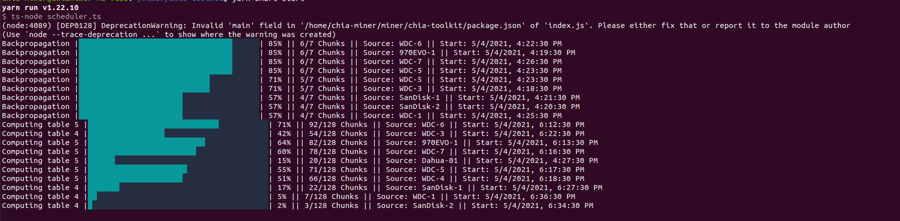

## Setup

`build from source`

`.env`

```
FINGERPRINT=xxxxxxx
CHIA_PATH=/home/chia-miner/miner/chia-blockchain
CHIA_BIN=/home/chia-miner/miner/chia-blockchain/venv/bin/chia
OUTPUT_PATH=/media/chia-miner/ST-16T-0
```

```
yarn
yarn smart-plot
```

## Environment Requirements

<!-- - [mongoDB](https://docs.mongodb.com/manual/tutorial/install-mongodb-on-ubuntu/) -->

- ubuntu 20.04
- node >=16

## Roadmap

- cli
  - [x] show phase 2 - 4 progress
  - [ ] calculate ETA by disk write/read
- database
  - [ ] save time cost from different params pair
- scheduler
  - [x] get usable SSDs
  - [x] get current active chia plots' task
  - [x] get available storage size
  - [x] create new plot task automatically
  - [ ] support ssd which size != 1T
- UI
  - [ ] init dashboard with basic operations
